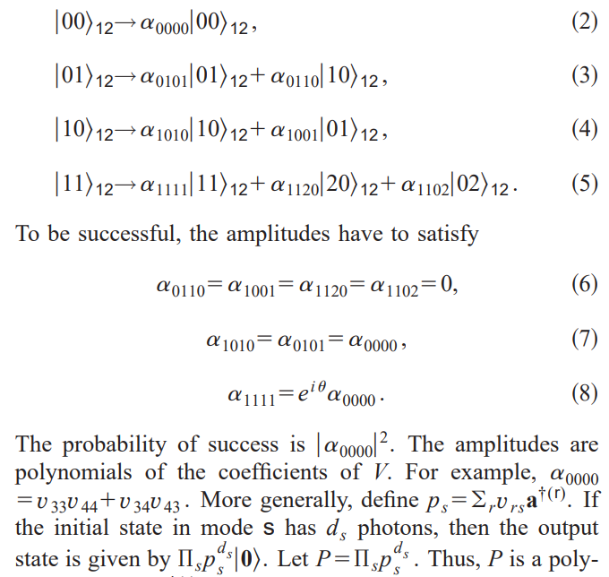

# iQuhack-2024-QccZ
Our group "Qccz" has come up with the following algorithms that can implement the CZ gate and the CCZ gate.
The goal is to write the Unitary matrix of the transformation gate. Our approach was to write the 
From Ref[5] of the problem set, we came up with the formalism to get the "alpha" values while writing the tranformation matrix of the CZ gate. 

Before diving into our own algorithmic approaches, we reproduces the CZ gate according to Ref. [5] and did a naive implementation of the CCZ gate by simply describing the circuit in Qiskit and converting it to the Quandela framework. These two steps (which can be seen in the notebooks cz and ccz) are only to be seen as a warm-up. 

To design our own versions of the different required gates, like the CCZ in both dual-rail- and hybrid encoding, as well as the Toffoli- and "bonus" gates in hybrid encoding. we came up with a general algorithm, which allows us to synthesis arbitary linear optical circuit unitaries based on the known action of the gates. 

We will use this document to briefly outline the general idea. Following Ref. [5] and [6], we can connect the underlying unitary matrix of the linear optical circuit to the desired "truth table" of our quantum operation. Specifically, we are referring to this part of Ref. [5], although we consider the generelization to arbitrary numbers of qubits/modes and heralding modes. 

We have designed a function which, based on a circuit unitary, can compute all of the coefficients $\alpha$ as a sum of polynomials in the unitary matrix elements. The degree of the polynomial is determined by the number of occupied modes in the input state. As in Ref. [5], we derive conditions that the coefficients $\alpha$ have to satisfy to obtain the correct (probabilistic) unitary. This way we obtain a system of equations in the coefficients $\alpha$. Because this system is extemely hard to solve as a function of the unitary matrix elements, we employ a parallelized bruteforce approach, where we judge the qualitiy of our solution by defining some penalty function. This penalty function takes in the circuit unitary and returns a measure for the difference between the obtained $\alpha$ and the ideal $\alpha$. Simultaneously, we can employ the coefficients $\alpha$ to straightforwardly compute the success probability, as outlined in Ref. [5].

Our circuit matrices are just a bunch of random unitaries which are then assessed based on the penalty function. Since we are only concerned with three-qubit gates here, we do not have to worry about poor scalability of this approach.

We observe that good random unitaries produce similar success probabilities as in Ref. [6]. However, one could also employ our method to design unitaries with worse fidelities but higher success probabilites instead. This is just a matter of selecting appropriate optimization criteria. 

